리액트를 사용해 애플리케이션의 인터페이스 설계시 → **사용자가 볼 수 있는 요소는 여러가지 컴포넌트**로 구성

ex. Todo 일정관리 애플리케이션의 4가지 컴포넌트

- TodoTemplate
- TodoInput
- TodoList
- TodoItem

컴포넌트의 기능 : 데이터 주어졌을 때 이에 맞게 UI를 만들고, 라이프사이클 API를 이요해 컴포넌트가 화면에서 나타날 때, 사라질 때, 변화가 일어날 때 주어진 작업들을 처리할 수 있으며, 임의 메서드를 만들어 특별한 기능 추가도 가능함 

(이 장에서 배울 것)

- 클래스형 컴포넌트
- 컴포넌트를 만들고 사용하는 방법
- 속성값 props
- 상태값 state

# 3.1 클래스형 컴포넌트

## **컴포넌트 선언하는 방식**

### **1) 함수형 컴포넌트**

```jsx
// 2장
import React from 'react'
import './App.css'

function App() {
  const name = "리액트"
  return <div className="react">{name}</div>;
}

export default App;
```

- function 키워드 방식
- 화살표 함수 방식 → 좀 더 간결

(장점) 

- 선언이 쉽다
- 메모리 자원 절약
- 배포시 결과물 파일의 크기가 작음 (큰 차이는 아님)

(단점)

- state, 라이프사이클 API 사용이 불가능 → **Hooks 기능** 도입으로 조금 다른 방식으로 해결! ⇒ 컴포넌트 새로 작성시 리액트 공식 매뉴얼 권장 방식

### **2) 클래스형 컴포넌트**

```jsx
import React, {Component} from 'react'

class App extends Component {
  render() { // render() 함수가 반드시 존재!! - 그 내부에 보여주어야할 JSX 반환!
    const name = "리액트";
    return <div className="react">{name}</div>;
  }
}
  
export default App;
```

⇒ 함수형 컴포넌트와 역할은 동일!

⇒ (차이점) 클래스형 컴포넌트의 경우, **state기능** 및 **라이프사이클 기능**을 사용할 수 있음, **임의 메서드 정의** 가능!

⇒ **render() 함수**가 꼭 존재해야 함! → 그 안에서 보여주어야 할 JSX를 반환!

(노트) ES6 부터는 class 사용하여 구현 가능!

*책의 강의의 경우 초반ㅗ에서는 **"2) 클래스형 컴포넌트" 위주**로 리액트의 기본기를 익힘! 


# 3.2 첫 컴포넌트 생성

(첫 컴포넌트 생성)

파일 만들기

→ 코드 작성하기

→ 모듈 내보내기 및 불러오기

## 3.2.1 src 디렉터리에 MyComponent.js 파일 생성

## 3.2.2 코드 작성하기

(src > MyComponent.js)

```jsx
import React from 'react';

const MyComponent = () => {
    return <div>나의 새롭고 멋진 컴포넌트</div>;
};

export default MyComponent;
```

### ES6의 화살표 함수 문법 (교과서 p.89 참고)

**`() => {}`** : 함수를 생성

주로 함수 파라미터를 전달할 때 유용!! (기존 function을 이용한 함수선언 방식을 아예 대체하는 것이 아님, 용도가 조금 다르다!)

***1)함수형 컴포넌트 선언시,**

function 키워드 vs. 화살표 함수 문법 : 큰 차이는 없으나 **화살표 함수 문법이 좀 더 간결!**

(노트) Reactjs Code Snippet으로 코드 생성

에디터에서 **rsc 입력** 후, enter 키

cf. 클래스형 컴포넌트 : **rcc 입력**

## 3.2.3 모듈 내보내기 및 불러오기

### 3.2.3.1 export - 모듈 내보내기

(src > MyComponent.js)

```jsx
import React from 'react';

const MyComponent = () => {
    return <div>나의 새롭고 멋진 컴포넌트</div>;
};

export default MyComponent; // export : 다른 파일에서 이 파일을 import할 때, 이 클래스를 불러오도록 설정
```

### 3.2.3.2 import - 모듈 불러오기

(src > App.js)

```jsx
import React from 'react';
import MyComponent from './MyCoponent.js';

const App = () => {
  return <MyComponent />;
};
  
export default App;
```

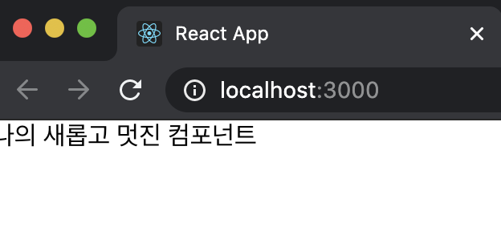

# 3.3 props - "속성 설정"

Properties의 약어

컴포넌트 속성을 설정할 때 사용하는 요소

: props 값은 해당 컴포넌트를 불러와 사용하는 **부모 컴포넌트에서 설정 가능**

## 3.3.1 JSX 내부에서 props 렌더링

```jsx
import React from 'react';

const MyComponent = props => {
    return <div>안녕하세요, 제 이름은 {props.name}입니다.</div>;
};

export default MyComponent; 
```

: MyCoponent에서 name이라는 props를 렌더링하도록 설정

**JSX 내부에서 {}로 기호로 감싸준다!**

## 3.3.2 컴포넌트를 사용할 때 props 값 지정하기

(src > App.js)

```jsx
import React from 'react';
import MyComponent from './MyCoponent.js';

const App = () => {
  return <MyComponent name="React"/>;
};
  
export default App;
```

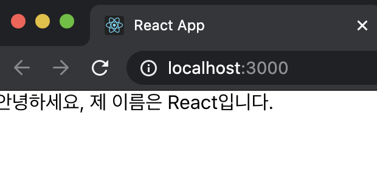

## 3.3.3 props 기본 값 설정 : defaultProps

### props 값을 따로 지정하지 않았을 때 보여줄 기본값 설정

(src > MyCoponent.js)

```jsx
import React from 'react';

const MyComponent = props => {
    return <div>안녕하세요, 제 이름은 {props.name}입니다.</div>;
};

MyComponent.defaultProps = {
    name : '기본이름'
};

export default MyComponent;
```
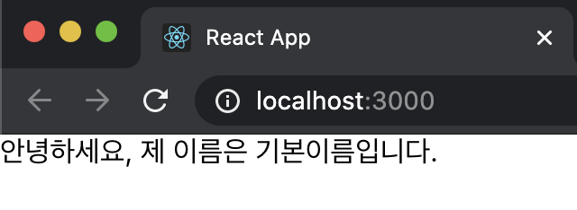

## 3.3.4 태그 사이의 내용을 보여주는 children

### children

컴포넌트 사용시 태그 사이의 내용을 보여주는 props

(src > App.js)

```jsx
import React from 'react';
import MyComponent from './MyCoponent.js';

const App = () => {
  return <MyComponent>리액트</MyComponent>;
};

export default App;
```

: MyComponent 태그 사이에 작성한 '리액트' 문자열을 MyComponent 내부에서 보여주려면 props.childen 값을 보여주어야 함

(src > MyComponent.js)

```jsx
import React from 'react';

const MyComponent = props => {
    return (
        <div>
            안녕하세요, 제 이름은 {props.name}입니다. <br/>
            children 값은 {props.children}
            입니다.
        </div>
    );
};

MyComponent.defaultProps = {
    name : '기본이름'
  };

export default MyComponent;
```
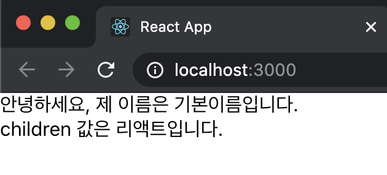


## 3.3.5 비구조화 할당 문법을 통해 props 내부값 추출하기

### 비구조화 할당 (Destructuring Assignment) - ES6

구조 분해 문법, 함수의 파라미터 부분에서도 사용 가능

만약 함수의 파라미터가 객체라면 그 값을 바로 비구조화하여 사용함!!

(src > MyComponent.js)

```jsx
import React from 'react';

const MyComponent = props => {
    const {name, children} = props; // 
    return (
        <div>
            안녕하세요, 제 이름은 {name}입니다. <br/> //
            children 값은 {children} //
            입니다.
        </div>
    );
};

MyComponent.defaultProps = {
    name : '기본이름'
  };

export default MyComponent;
```

⇒ name, children 값을 더 짧은 코드로 사용 가능

(src > MyComponent.js)

```jsx
import React from 'react';

const MyComponent = ({name, children}) => { //
    return (
        <div>
            안녕하세요, 제 이름은 {name}입니다. <br/>
            children 값은 {children}
            입니다.
        </div>
    );
};

MyComponent.defaultProps = {
    name : '기본이름'
  };

export default MyComponent;
```

⇒ 훨씬 더 간단!!😎

앞으로 **함수형 컴포넌트**에서 props를 사용시, 다음과 같이 **비구조화 할당 문법을 사용~**

## 3.3.6 propTypes를 통한 props 검증

### propTypes

컴포넌트의 필수 props를 지정하거나 props의 타입을 지정할 때 사용

지정 방법은 defaultProp와 유사

propTypes를 사용하려면, import 구문 필요

(src > MyComponent.js)

```jsx
import React from 'react';
import PropTypes from 'prop-types'; //

const MyComponent = ({name, children}) => {
    return (
        <div>
            안녕하세요, 제 이름은 {name}입니다. <br/>
            children 값은 {children}
            입니다.
        </div>
    );
};

MyComponent.defaultProps = {
    name : '기본이름'
};

MyComponent.propTypes = { // 
    name : PropTypes.string
};

export default MyComponent;
```

: import 구문 필요

: name값은 반드시 string 형태

🤔 App 컴포넌트에서 **name 값을 숫자로 전달**한다면?

(src > App.js)

```jsx
import React from 'react';
import MyComponent from './MyCoponent.js';

const App = () => {
  return <MyComponent name={3}>리액트</MyComponent>;
};

export default App;
```

: 실행한 뒤 개발자 도구의 Console 탭을 연다면, 경고메세지 확인 가능! (타입 불일치)

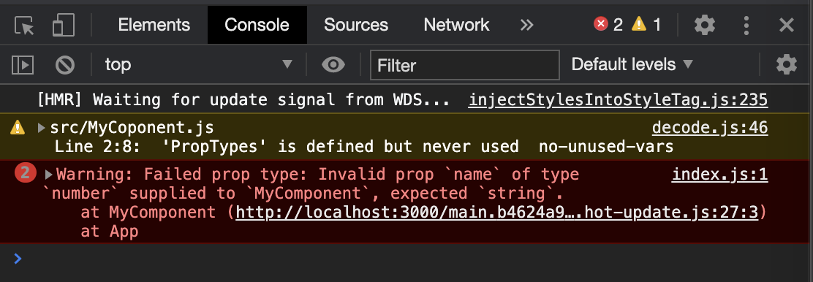


### 3.3.6.1 isRequired를 사용하여 필수 propTypes 설정

### isRequired

propTypes를 지정하지 않았을 때 오류메세지를 띄움

(src > MyComponent.js)

```jsx
import React from 'react';
import PropTypes from 'prop-types';

const MyComponent = ({name, favoriteNumber, children}) => { //
    return (
        <div>
            안녕하세요, 제 이름은 {name}입니다. <br/> 
            children 값은 {children}
            입니다.
            <br/>
            제가 좋아하는 숫자는 {favoriteNumber}입니다. //
        </div>
    );
};

MyComponent.defaultProps = {
    name : '기본이름'
};

MyComponent.propTypes = {
    name : PropTypes.string,
    favoriteNumber : PropTypes.number.isRequired //
};

export default MyComponent;
```

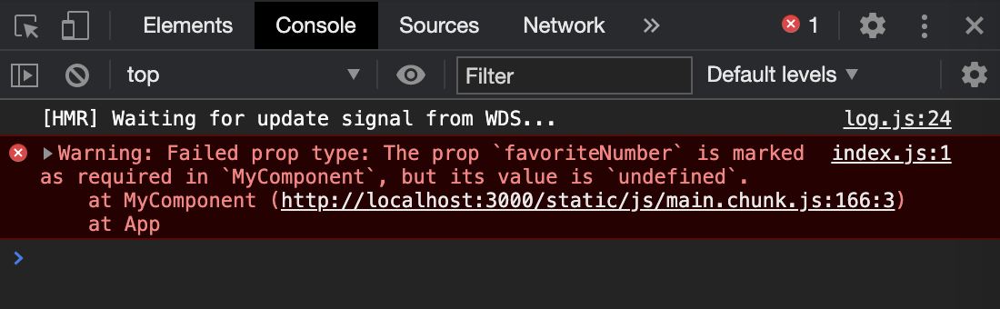

: 아직 favoriteNumber를 설정하지 않아서 다음과 같은 오류 메세지 발생

(MyComponent에게 FavoriteNumber 부여)

```jsx
import React from 'react';
import MyComponent from './MyCoponent.js';

const App = () => {
  return (
    <MyComponent name="React" favoriteNumber={1}> //
      리액트
    </MyComponent>
  );
};

export default App;
```

### 3.3.6.2 더 많은 PropTypes 종류

(교과서 p.101 참고)

자세한 정보 : [https://github.com/facebook/prop-types](https://github.com/facebook/prop-types) 참고

## 3.3.7 클래스형 컴포넌트에서 props 사용하기

render 함수에서 this.props를 조회하면 된다!

defualtProps & propsTypes은 동일한 방식으로 설정~

(src > MyComponent.js)

```jsx
import React, { Component } from 'react';
import PropTypes from 'prop-types';

class MyComponent extends Component {
    render() {
        const {name, favoriteNumber, children} = this.props; // 비구조화 할당
        return (
            <div>
                안녕하세요, 제 이름은 {name}입니다. <br/> 
                children 값은 {children}
                입니다.
                <br/>
                제가 좋아하는 숫자는 {favoriteNumber}입니다.
            </div>
        );
    }
}

MyComponent.defaultProps = {
    name : '기본이름'
};

MyComponent.propTypes = {
    name : PropTypes.string,
    favoriteNumber : PropTypes.number.isRequired
};

export default MyComponent;
```

클래스형 컴포넌트에서 defualtProps와 propTypes를 설정할 때 **class 내부에서 지정하는 방법**도 존재함!

(src > MyComponent.js)

```jsx
import React, { Component } from 'react';
import PropTypes from 'prop-types';

class MyComponent extends Component {
    static defaultProps = {
        name : '기본이름'
    };

    static propTypes = {
        name : PropTypes.string,
        favoriteNumber : PropTypes.number.isRequired
    };
    
    render() {
        const {name, favoriteNumber, children} = this.props; // 비구조화 할당
        return (
            <div>
                안녕하세요, 제 이름은 {name}입니다. <br/> 
                children 값은 {children}
                입니다.
                <br/>
                제가 좋아하는 숫자는 {favoriteNumber}입니다.
            </div>
        );
    }
}

export default MyComponent;
```

(노트) defualtProps와 propTypes는 꼭 사용해야 하는가?

컴포넌트 필수사항은 아님

하지만, 협업시 해당 컴포넌트에 어떤 props가 필요한지 쉽게 알 수 있어 개발 능률이 좋아짐!


# 3.4 state - "상태 값"

### state

컴포넌트 내부에서 **바뀔수 있는 값**

### **cf) props**

**: 컴포넌트 사용 과정에서 부모 컴포넌트가 설정하는 값**

: 컴포넌트 자신은 해당 props를 읽기 전용으로만 사용 가능

→ props를 바꾸려면 부모 컴포넌트에서 변경해야 함!

ex. App 컴포넌트에서 MyComponent를 사용할 때 props를 바꾸어야 값 변경 가능!

(부모 : App, 자식 : MyComponent)

## 3.4.1 클래스형 컴포넌트의 state

(src > Counter.js)

```jsx
import React, {Component} from 'react';

class Counter extends Component {
    // 생성자
    constructor(props) {
        super(props); // 반드시 호출 : 현재 클래스형 컴포넌트가 상속받고 있는 리액트의 Component 클래스가 지닌 생성자 함수를 호출
        // state의 초기값 설정
        this.state = {
            number : 0
        };
    }
    
    render() {
        const {number} = this.state; // state를 조회할 때는 this.state로 조회
        return (
            <div>
                <h1>{number}</h1>
                <button
                    // onClick을 통해 버튼이 클릭되었을 때 호출할 함수를 지정
                    onClick={()=>{
                        // this.setState를 사용하여 state에 새로운 값을 넣을 수 있음
                        this.setState({number: number + 1}) // 값 변경 함수
                    }}
                > // 이벤트 설정 : 화살표 함수 문법
                    +1    
                </button> 
            </div>
        );
    }
}

export default Counter;
```

(src > App.js)

```jsx
import React from 'react';
import Counter from './Counter.js';

const App = () => {
  return (
    <Counter />
  );
};

export default App;
```

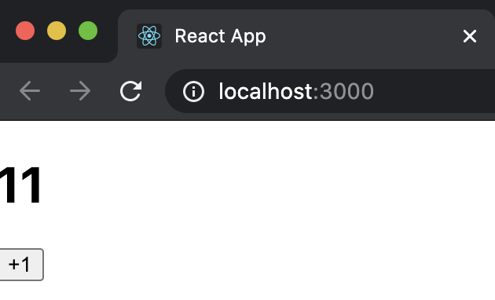

### 3.4.1.1 state 객체 안에 여러 값이 있을 때

(src < Counter.js) : 현재 state 안에 fixedNumber 라는 값을 추가

→ 버튼 클릭시 number의 값만 증가하고, fixedNumber의 값은 유지

```jsx
import React, {Component} from 'react';

class Counter extends Component {
    // 생성자
    constructor(props) {
        super(props); 
        // state의 초기값 설정
        this.state = {
            number : 0,
            fixedNumber : 0
        };
    }
    
    render() {
        const {number, fixedNumber} = this.state; // state를 조회할 때는 this.state로 조회
        return (
            <div>
                <h1>{number}</h1>
                <h2>바뀌지 않는 값 : {fixedNumber}</h2>
                <button
                    // onClick을 통해 버튼이 클릭되었을 때 호출할 함수를 지정
                    onClick={()=>{
                        // this.setState를 사용하여 state에 새로운 값을 넣을 수 있음
                        this.setState({number: number + 1})
                    }}
                >
                    +1    
                </button>
            </div>
        );
    }
}

export default Counter;
```
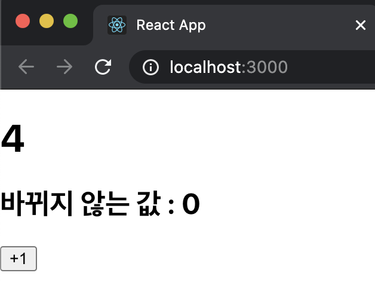

: this.setState 함수는 인자로 전달된 객체 안에 들어있는 값만 바꾸어 주기에 인자로 fixedNumber를 넣지는 않음!

### 3.4.1.2 state를 constructor에서 꺼내기

3.4.1.1; state의 초기값 지정을 위해 constructor 메서드를 선언함!

(또 다른 방식) - state 초기값 지정 

**: constructor 메서드 (생성자)를 선언하지 않고도** state 초기값 설정 가능

→ 책에서는 앞으로 이 방식으로 state의 초기값을 설정할 것!

```jsx
import React, {Component} from 'react';

class Counter extends Component {
    state = {
        number : 0,
        fixedNumber : 0
    };

    render() {
        const {number, fixedNumber} = this.state; // state를 조회할 때는 this.state로 조회
        return (
            <div>
                <h1>{number}</h1>
                <h2>바뀌지 않는 값 : {fixedNumber}</h2>
                <button
                    // onClick을 통해 버튼이 클릭되었을 때 호출할 함수를 지정
                    onClick={()=>{
                        // this.setState를 사용하여 state에 새로운 값을 넣을 수 있음
                        this.setState({number: number + 1})
                    }}
                >
                    +1    
                </button>
            </div>
        );
    }
}

export default Counter;
```

### 3.4.1.3 this.setState에 객체 대심 함수 인자 전달하기

**: this.setState를 사용해 state 값을 업데이트** 할 때 → 비동기적으로 업데이트!

(src > Counter.js - button onClick)

```jsx
onClick={()=>{
    // this.setState를 사용하여 state에 새로운 값을 넣을 수 있음
    this.setState({number: number + 1})
    this.setState({number: this.state.number + 1})
}}
```

⁉️ this.setState 2번 호출 → but, 숫자는 1씩 더해짐?!

⇒ this.setState를 사용한다고 해서 state 값이 바로 바뀌는 것은 아님~

(Solution) this.setState를 사용할 때, 객체 대신에 **함수를 인자**로 넣어주는 것!

### **(형식) - this.setState의 인자로 함수를 넣어줄 때 코드**

```jsx
this.setState((prevState, props) => {
	return {
		// 업데이트 내용
	}
})
```

- prevState : 기존 상태
- props : 현재 지니고 있는 props → 필요 없으면, 생략가능!

(src > Counter.js - button onClick)

```jsx
onClick={()=>{
    // this.setState를 사용하여 state에 새로운 값을 넣을 수 있음
		// **case1)**
    this.setState(prevState => {
        return {
            number: prevState.number + 1
        }
    });

    // 동일한 코드 
		// **case2)** 함수에서 바로 객체를 반환~
		// prevState => ({  }) 형식의 코드!
    this.setState(prevState=> ({
        number: prevState.number +1
    }))
}}
```
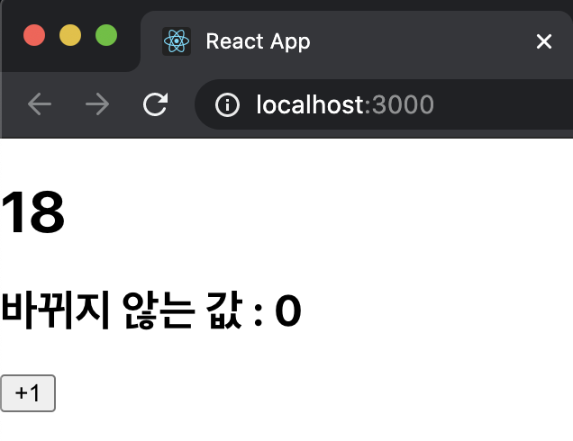

: 숫자가 2씩 증가함

📌  화살표 함수에서 값을 바로 반환?

: 코드 블록 { }를 생략! (위 예시의 case2 참고)

```jsx
const sum = (a, b) => a+b;
```

### 3.4.1.4 this.setState가 끝난 후 특정 작업 실행하기

: setState를 사용해 값 업데이트 한 후 특정 작업을 하고 싶을 때는 setState의 두번째 파라미터로 콜백(callback) 함수를 등록해 작업을 처리

(src > Counter.js - button onClick)

```jsx
<button
    // onClick을 통해 버튼이 클릭되었을 때 호출할 함수를 지정
    onClick={()=>{
        this.setState (
            {
                number: number + 1
            },
            () => {
                console.log('방금 setState가 호출되었습니다.');
                console.log(this.state);
            }
        );
    }}
>
    +1    
</button>
```

: 콜백함수 등록 후 브라우저를 열어 개발자 도구의 Console 탭을 확인!

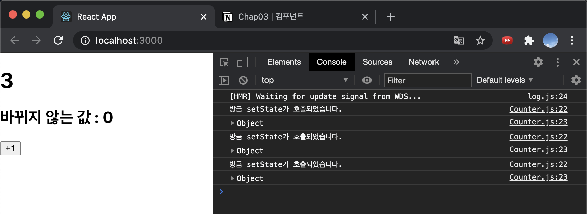


## 3.4.2 함수형 컴포넌트에서 useState 사용하기

useState() 함수를 사용해 "함수형 컴포넌트"에서도 state 사용 가능!!

### 3.4.2.1 배열 비구조화 할당

객체 비구조화 할당과 비슷

: 배열 안에 들어 있는 값을 쉽게 추출할 수 있도록 함

```jsx
const array=[1,2];
const one=array[0];
const two=array[1];

// 비열 비구조화 할당 -> 훨.씬.깔.끔!
const array=[1,2];
const [one, two] = array;
```

### 3.4.2.2 useState 사용하기

(src > Say.js)

```jsx
import React, {useState} from 'react';

const Say = () => {
    const [message, setMessage] = useState('');
    const onClickEnter = () => setMessage('안녕하세요!');
    const onClickLeave = () => setMessage('안녕히 가세요!');

    return (
        <div>
            <button onClick={onClickEnter}>입장</button>
            <button onClick={onClickLeave}>퇴장</button>
            <h1>{message}</h1> 
        </div>
    );
};

export default Say;
```

- 클래스형 컴포넌트 : state 초기값은 객체의 형태를 넣어야 함
- useState() 함수 :  반드시 객체가 아니어도 가능

함수 호출시; 배열 반환

**message : 현재 상태**

**setMessage : 상태를 바꾸는 함수** → setter 함수

(src > App.js)

```jsx
import React from 'react';
import Say from './Say.js';

const App = () => {
  return (
    <Say />
  );
};

export default App;
```

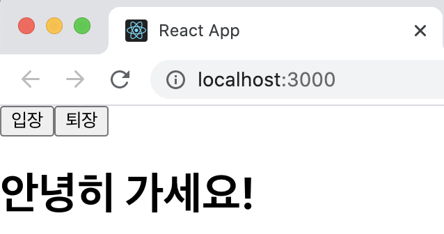

### 3.4.2.3 한 컴포넌트에서 useState 여러 번 사용하기

useState는 한 컴포넌트에서 여러번 사용도 된다!

(src  > Say.js)

```jsx
import React, {useState} from 'react';

const Say = () => {
    const [message, setMessage] = useState('');
    const onClickEnter = () => setMessage('안녕하세요!');
    const onClickLeave = () => setMessage('안녕히 가세요!');

    const [color, setColor] = useState('black');

    return (
        <div>
            <button onClick={onClickEnter}>입장</button>
            <button onClick={onClickLeave}>퇴장</button>
            <h1 style={{ color }}>{message}</h1> 

            <button style={{ color: 'red' }} onClick={() => setColor('red')}>빨간색</button>
            <button style={{ color: 'green' }} onClick={() => setColor('green')}>초록색</button>
            <button style={{ color: 'blue' }} onClick={() => setColor('blue')}>파란색</button>

        </div>
    );
};

export default Say;
```


# 3.5 state를 사용할 때 주의사항

*****(클래스형/함수형 컴포넌트 모두 해당)

**state 값을 바꾸어야 할 때는 setState 혹은 useState를 통해 전달받은 setter 함수를 사용해야 함!**

배열/객체 업데이트시, 어떻게?

배열/객체 사본을 만들고 그 사본에 값을 업데이트 → 그 사본의 상태를 setState 혹은 setter함수를 통해 업데이트

```jsx
// 객체 다루기
const object = {a:1, b:2, c:3};
const nextObject = {...object, b:2};

// 배열 다루기
const array = [
    {id:1, value:true},    
    {id:2, value:true},
    {id:3, value:false},
];
let nextArray = array.concat({id:4}); // 새항목 추가
nextArray.filter(item => item.id !== 2) // id가 2인 항목 제거
nextArray.map(item => (item.id === 1 ? {...item, vlae :false}:item)); // id가 1인 항목의 value를 false로 설정
```

⇒ **객체에 대한 사본**을 만들 때, **spread 연산자라 불리는 ...**을 사용해 처리

⇒ **배열에 대한 사본**을 만들 때, **배열의 내장 함수**로 처리

---

# 3.6 정리

1. 컴포넌트를 생성하고, 불러오기/내보내기
2. props 사용법 "속성 설정"
3. state 사용법 "상태 값"

(props vs. state)

(공통점) 

- 컴포넌트에서 사용
- 렌더링할 데이터를 담고 있음

(차이점)

- **props** : **부모 컴포넌트가 설정**

    ⇒ 무조건 고정적이지는 않다! (부모 컴포넌트의 state를 자식 컴포넌트의 props로 전달하고, 자식 컴포넌트에서 특정이벤트가 발생할 때, 부모 컴포넌트의 메세지를 호출한다면 props도 유동적 사용이 가능함)

- **state** : **컴포넌트 자체적으로** 지닌 값 → 컴포넌트 내부에서 값 없데이트 가능!


1. 클래스형 컴포넌트의 state
2. 함수형 컴포넌트의 **useState** 

    **⇒ (훨씬 간결함, 권장)**
